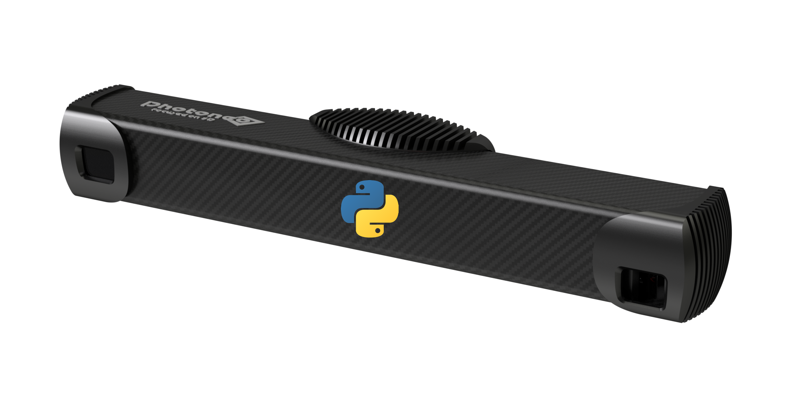
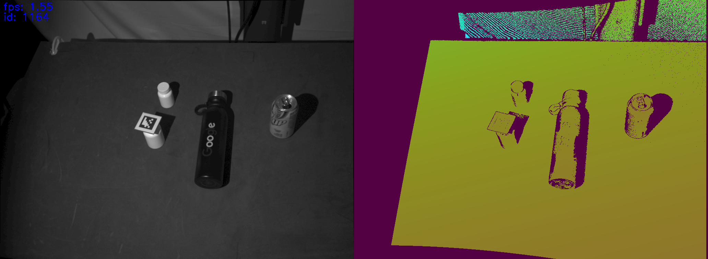

# pyphoxi

This is a simple Python/C++ TCP communication module for the [PhotoNeo PhoXi](https://www.photoneo.com/) structured light sensors. It consists of:

* C++ code that fetches data from a PhoXi sensor using the PhoXi API and hosts it on a TCP server.
* Python client code that fetches data from the TCP server.

<p align="center">
 
</p>

## Example

Execute `PhoXiControl` then fire up the TCP server:

```bash
./scripts/run.sh
```

Vizualize an RGB-D feed in OpenCV:

```python
python scripts/view_feed.py 127.0.0.1 50200
```

<p align="center">
 
</p>

## Installation

Run the instructions [here](https://github.com/kevinzakka/pyphoxi/blob/master/INSTRUCTIONS.md).

## References

- [Andy Zeng's RealSense Code](https://github.com/andyzeng/visual-pushing-grasping/tree/master/realsense)